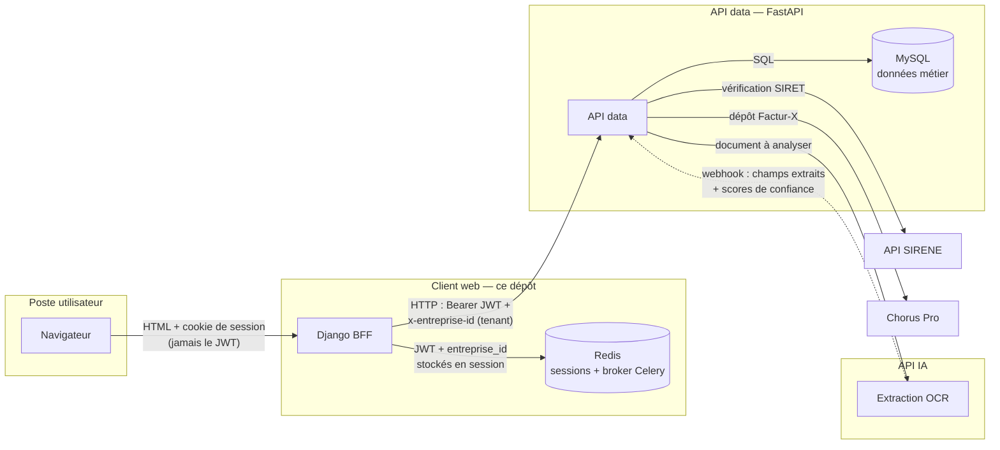
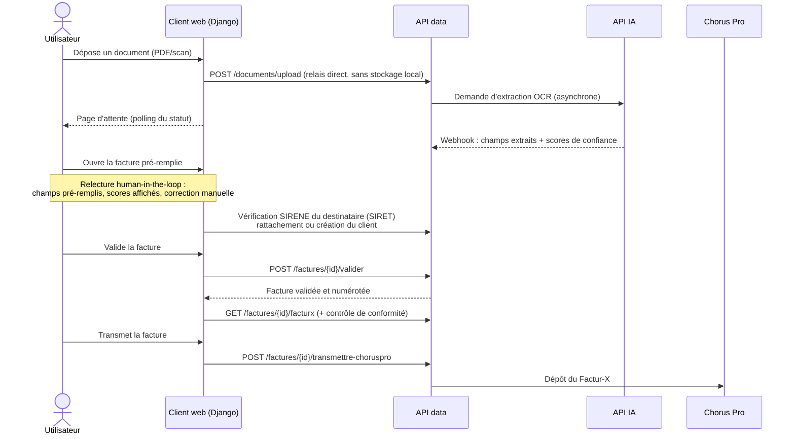

# factur-ia-web-client

Client web de **Factur-IA**, solution de dématérialisation de factures : dépôt d'un document (PDF ou scan), extraction automatique par OCR, relecture et validation par l'utilisateur, génération **Factur-X** et transmission à **Chorus Pro**.

Ce dépôt est l'interface utilisateur de la plateforme : une application **Django 6 (Python 3.13)** en rendu serveur, construite comme un **BFF (Backend-For-Frontend)**. Elle ne stocke aucune donnée métier : elle authentifie l'utilisateur auprès de l'API data, garde le JWT en session côté serveur et relaie tous les appels.

## Architecture

### Les trois services, et pourquoi ce découpage

| Service | Rôle | Dépôt |
| --- | --- | --- |
| **Client web** (ce dépôt) | Interface utilisateur, sessions, relais authentifié des appels | `factur-ia-web-client` |
| **API data** (FastAPI) | Données métier (MySQL), règles de gestion, orchestration OCR, intégrations SIRENE et Chorus Pro | `factur-ia-api-data` |
| **API IA** | Extraction OCR des documents (asynchrone, répond par webhook) | `factur-ia-api-ia` |

Ce découpage tient en trois arguments :

- **Sécurité** : le JWT ne transite jamais par le navigateur — il vit dans la session Redis du client web, qui l'injecte côté serveur à chaque appel. Le navigateur ne détient qu'un cookie de session.
- **Un seul point d'entrée aux données** : personne ne parle à la base ni aux services externes (SIRENE, Chorus Pro) sauf l'API data, qui porte les règles métier.
- **Indépendance de l'IA** : l'extraction OCR est coûteuse et asynchrone ; l'isoler permet de la faire évoluer (ou de la remplacer) sans toucher au reste.

### Flux de communication

Le navigateur ne parle **qu'au client Django**. Le client ne parle **qu'à l'API data**. L'API IA et les services externes ne sont joignables que par l'API data.



Côté code, ce flux se lit dans `clients/` : toute requête HTTP vers l'API data passe par `BaseAPIClient` (`clients/base_client.py`), qui injecte les en-têtes d'authentification, applique timeouts et rejeux (backoff exponentiel sur erreurs transitoires, méthodes idempotentes uniquement) et traduit les erreurs HTTP en exceptions métier. Le webhook OCR n'existe volontairement pas ici : il est réservé à l'échange API IA → API data.

### Parcours d'une facture

Le fil conducteur du produit, de bout en bout :



Après validation, une facture peut aussi donner lieu à un **avoir** (`POST /factures/{id}/avoir`).

### Authentification et sécurité

- **Connexion** : `POST /auth/token` (flux OAuth2 password) via un client dédié sans session (`clients/api_client.py`) ; le JWT retourné est stocké **en session Django, côté serveur** (Redis).
- **Multi-tenant** : l'`entreprise_id` de la session est envoyé dans l'en-tête `x-entreprise-id` de chaque appel ; l'isolation des données est appliquée par l'API data.
- **Expiration** : gérée deux fois — en amont, le middleware `SessionExpiryMiddleware` purge la session dès que le JWT qu'elle porte est expiré ; en aval, tout 401 de l'API vide la session et redirige vers la connexion.
- **CSRF** : protection Django standard sur tous les formulaires.

## Prérequis

- **Python 3.13** et **[uv](https://docs.astral.sh/uv/)** (gestionnaire de paquets et d'environnements).
- **Docker + Docker Compose** (au minimum pour Redis).
- L'**API data** accessible (par défaut sur `http://127.0.0.1:8080`) — sans elle, les pages s'affichent mais sans données.

## Installation

```bash
git clone <url-du-depot> && cd factur-ia-web-client

# 1. Dépendances (avec les groupes de dev : tests, linters, pre-commit)
uv sync --all-groups

# 2. Configuration
cp .env.example .env
# puis renseigner SECRET_KEY (openssl rand -hex 32) et vérifier API_DATA_URL

# 3. Redis (sessions + broker Celery)
docker compose up -d redis
```

Aucune migration à exécuter : le client n'a **aucun modèle de données local** (les sessions vivent dans Redis, les données métier dans l'API data). Pas de `createsuperuser` non plus — les comptes utilisateurs sont ceux de l'API data.

## Lancement

### Hors Docker (workflow de dev habituel)

```bash
# Serveur de dev + compilation Tailwind à la volée
uv run python manage.py tailwind runserver

# Worker Celery (optionnel : infrastructure prête, aucune tâche applicative à ce jour)
uv run celery -A config.celery worker --loglevel=info
```

Application sur <http://localhost:8000>.

### Avec Docker

```bash
docker compose up --build
```

Trois services : **web** (le client Django, lancé avec `manage.py tailwind runserver`, projet monté dans le conteneur pour le rechargement à chaud), **worker** (même image, commande Celery) et **redis**. Le compose surcharge `CELERY_BROKER_URL`/`CELERY_RESULT_BACKEND` (vers le service `redis`) et `API_DATA_URL` (vers `http://host.docker.internal:8080`, l'API tournant sur l'hôte) ; le `.env` garde ses valeurs `localhost` pour l'usage hors Docker.

Deux conditions côté hôte :

- l'API data doit écouter sur `0.0.0.0:8080` (et pas seulement `127.0.0.1`), sinon les conteneurs ne la joignent pas via `host.docker.internal` ;
- il n'y a volontairement **ni base de données ni reverse proxy** dans ce compose (le client n'en a pas besoin) ; la stack d'observabilité (Prometheus + Grafana) vit dans le dépôt d'infrastructure [`factur-ia-infra`](https://github.com/Malek-Boumedine/factur-ia-infra) (voir la section Observabilité).

**Note Tailwind** : `django-tailwind-cli` télécharge un binaire Tailwind autonome (pas de Node) au premier lancement, dans `static/css/tailwind/` — monté depuis l'hôte, donc téléchargé une seule fois. En cas d'échec réseau au premier démarrage, le CSS compilé et versionné (`static/css/tailwind.css`) prend le relais ; `docker compose restart web` une fois le réseau revenu.

## Commandes utiles

| Commande | Rôle |
| --- | --- |
| `uv run python manage.py tailwind runserver` | Serveur de dev + watcher Tailwind |
| `uv run python manage.py tailwind build` | Compilation CSS seule (one-shot) |
| `uv run celery -A config.celery worker --loglevel=info` | Worker Celery |
| `DJANGO_ENV=test uv run pytest` | Tests |
| `DJANGO_ENV=test uv run pytest --cov=. --cov-report=term-missing` | Tests avec couverture (la CI utilise `--cov-report=xml`) |
| `DJANGO_ENV=test uv run pytest core/tests/test_x.py -k test_name` | Un test précis |
| `uv run ruff check .` / `uv run ruff format .` | Lint / formatage |
| `uv run mypy .` | Vérification de types |
| `uv run pre-commit run --all-files` | Portail qualité complet |

Pour régénérer le client OpenAPI typé après une mise à jour du contrat : voir `docs/openapi-client-setup.md`.

## Variables d'environnement

Toutes lues depuis `.env` (modèle : `.env.example`, à copier — le `.env` réel n'est jamais commité).

| Variable | Rôle | Défaut | Obligatoire |
| --- | --- | --- | --- |
| `SECRET_KEY` | Clé secrète Django (`openssl rand -hex 32`) | — | **oui** |
| `API_DATA_URL` | URL de l'API data | — | **oui** |
| `DJANGO_ENV` | Settings chargés : `dev`, `test` ou `prod` | `dev` | non |
| `DEBUG` | Mode debug (lu en `dev` uniquement ; `prod` force `False`) | `True` | non |
| `ALLOWED_HOSTS` | Hôtes autorisés (liste séparée par virgules) | `localhost,127.0.0.1` en dev | en prod : oui |
| `CELERY_BROKER_URL` | Broker Celery ; sert aussi d'URL du cache Redis des sessions | sessions : `redis://127.0.0.1:6379/0` | pour le worker : oui |
| `CELERY_RESULT_BACKEND` | Backend de résultats Celery | — | pour le worker : oui |
| `API_CONNECT_TIMEOUT` | Timeout de connexion vers l'API data (s) | `5.0` | non |
| `API_READ_TIMEOUT` | Timeout de lecture vers l'API data (s) | `15.0` | non |
| `API_MAX_RETRIES` | Rejeux au-delà de la tentative initiale | `2` | non |
| `API_RETRY_BACKOFF` | Base du backoff exponentiel entre rejeux (s) | `0.5` | non |
| `SIGNUP_DEFAULT_ROLE_ID` | Rôle attribué au compte créé à l'inscription publique | `1` | non |
| `DOCUMENT_UPLOAD_MAX_SIZE` | Taille max d'un document uploadé (octets) | `10485760` (10 Mo) | non |
| `OTEL_METRICS_ENABLED` | Métriques Prometheus + endpoint `/metrics` | `False` | non |
| `OTEL_ENABLED` | Traces OpenTelemetry (export OTLP/HTTP) | `False` | non |
| `OTEL_SERVICE_NAME` | Nom du service dans la télémétrie | `factur-ia-web` | non |
| `OTEL_EXPORTER_OTLP_ENDPOINT` | Collector OTLP (traces) | `http://localhost:4318` | non |
| `OTEL_TRACES_EXPORTER` | `otlp` ou `console` (vérification sans collector) | `otlp` | non |
| `LOG_LEVEL` | Niveau de log global (`WARNING` conseillé en prod) | `INFO` | non |
| `RELEASE_TOKEN` | Token GitHub de python-semantic-release | — | CI uniquement |

## Tests

```bash
DJANGO_ENV=test uv run pytest
```

**`DJANGO_ENV=test` est obligatoire** : pytest-django n'a pas de configuration dans `pyproject.toml`, c'est `conftest.py` qui dérive le module de settings de cette variable — sans elle, les tests tournent sur les settings de dev (mauvais cache, mauvaise base).

Organisation : `core/tests/` (vues, formulaires, gardes d'accès, middleware, télémétrie) et `clients/tests/` (socle HTTP de la couche cliente : en-têtes, mapping d'erreurs, politique de rejeu). Les tests ne dépendent d'aucun service externe : l'API est mockée au niveau des clients, les sessions passent en cache mémoire, le backoff de rejeu est neutralisé.

## Observabilité (OpenTelemetry)

Le client est instrumenté avec OpenTelemetry, sur le même schéma que l'API data (`config/telemetry.py`) : requêtes entrantes (les pages du BFF) et surtout **appels sortants vers l'API data** — latence, taux d'erreur, indisponibilités — qui sont le point fragile d'un BFF sans données propres.

**Tout est désactivé par défaut** : sans variable d'activation, rien ne change en local ni en CI (aucun import du SDK, `/metrics` répond 404).

### Activer

Deux interrupteurs indépendants, à poser dans `.env` ou l'environnement : `OTEL_METRICS_ENABLED` (métriques + endpoint `/metrics` au format Prometheus, aucun collector requis) et `OTEL_ENABLED` (traces OTLP/HTTP ; `OTEL_TRACES_EXPORTER=console` pour vérifier sans collector). Un collector injoignable ne casse jamais l'application : l'export se fait en tâche de fond et échoue en silence.

⚠️ **`/metrics` ne doit jamais être public en production** : réservé au scrape Prometheus (réseau interne, ou protection par ingress).

### Visualisation : dépôt d'infrastructure

Ce dépôt ne fait qu'**exposer** les métriques sur `/metrics`. La stack de visualisation (Prometheus, Grafana, dashboards et règles d'alerte) est centralisée dans le dépôt [`factur-ia-infra`](https://github.com/Malek-Boumedine/factur-ia-infra), qui scrape les trois services (client web, API data, API IA) avec une stack unique. Voir son README pour la lancer et pour le détail des alertes.

Particularité à connaître côté client : l'instrumentation httpx standard n'enregistre **aucune métrique quand la connexion échoue** — le compteur maison `api_data_unavailable_total` (incrémenté par `clients/base_client.py` à chaque échec définitif après rejeux) comble ce trou ; c'est lui qui rend une API data éteinte visible dans les dashboards et les alertes.

### Ce que la télémétrie contient — et surtout pas

Contenu : méthode, route **templatée** (`factures/<int:facture_id>/`, jamais l'ID réel), statut, durée ; hôte et port de l'API data côté sortant. Jamais : en-têtes HTTP (le JWT `Authorization` et `x-entreprise-id` ne sont pas capturés), corps de requêtes/réponses, **query strings** (retirées des spans par les hooks de scrubbing — une recherche SIRENE porte un SIRET en query). `/metrics` et `/static/` sont exclus du tracing.

### Journalisation

Format texte lisible (`horodatage NIVEAU [logger] message`), configuré dans `config/settings/base.py`. Niveau global ajustable par la variable `LOG_LEVEL` (défaut `INFO` ; `WARNING` conseillé en production). Le logger `clients` est le canal dédié aux échanges avec l'API data : rejeux réseau en WARNING, échecs définitifs en ERROR. Les logs de `httpx` sont coupés sous WARNING (ils contiennent l'URL complète, query string incluse).

## Contrat API et versioning

- **Contrat OpenAPI** : ce client consomme le schéma exporté par l'API data, versionné dans `contracts/openapi.json` — jamais édité à la main. Mise à jour et régénération du client typé : `docs/openapi-client-setup.md`.
- **Versioning** : automatisé par python-semantic-release à partir des messages de commit (Conventional Commits), version dans `pyproject.toml`, historique dans `CHANGELOG.md`.
- **Conventions de contribution** (commits, langue, git flow) : voir `CLAUDE.md`.

## Livraison continue (`.github/workflows/deploy.yml`)

Workflow transposé de celui de `factur-ia-api-data` (conçu pour l'être — voir sa section « Livraison continue ») : mêmes décisions, seules les spécificités de ce dépôt changent.

**Partage des responsabilités** : Terraform (dépôt `factur-ia-infra`) possède la *forme* du service Cloud Run — configuration, secrets, compte de service runtime, IAM — et pose un `ignore_changes` sur l'image (déjà en place) ; la chaîne de livraison possède son *contenu* : elle construit l'image de production, la pousse dans Artifact Registry et déploie une nouvelle révision en ne passant que `--image`. Elle ne touche jamais à l'infrastructure.

**Déroulé** : à la publication d'une release GitHub (créée par le workflow Semantic Release au merge sur `main`), le workflow checkout le tag `vX.Y.Z` (le `pyproject.toml` y est déjà bumpé — l'image annonce la bonne version), construit l'image **depuis `Dockerfile.prod`** (Gunicorn + WhiteNoise — jamais l'image de dev) avec deux tags (`X.Y.Z` + `sha-<commit>`, pas de `latest`), la pousse, met à jour puis exécute le job de migration `factur-ia-migrate-web` (échec du job = arrêt du workflow, l'ancienne révision continue de servir), déploie la révision **par digest**, puis interroge `/health` — échec du workflow si la sonde ne répond pas. Un `workflow_dispatch` permet de (re)déployer n'importe quel tag existant sans créer de release (retour arrière compris).

**Ce qui diffère de l'API data** :

- **Sonde `/health` sans jeton d'identité** : ce service est le seul exposé publiquement (`run.invoker` accordé à `allUsers`), l'ingress n'exige pas d'authentification IAM — un simple `curl` suffit, et le compte de déploiement n'a pas besoin du rôle `run.invoker`.
- **Migration Django, pas Alembic** : le job `factur-ia-migrate-web` exécute `python manage.py migrate` — il ne crée que la table des sessions Django sur Cloud SQL (ce BFF ne détient aucune donnée métier). Même logique que l'API data : mise à jour de l'image du job, exécution avec `--wait`, échec bloquant avant la bascule.
- **`collectstatic` au build** : exécuté par le `Dockerfile.prod` lui-même, avec une `SECRET_KEY` factice posée en dur dans son `RUN` (elle ne sert qu'à charger les settings, la vraie clé n'entre jamais dans l'image). Le workflow n'a donc **rien à passer au build** — aucun `--build-arg`, aucun risque d'oubli.

### Variables GitHub à configurer

Aucun secret : avec la fédération d'identité, rien de confidentiel n'est stocké. Tout va dans les **variables de dépôt** (Settings → Secrets and variables → Actions → Variables) :

| Variable | Contenu | Exemple |
|---|---|---|
| `GCP_WORKLOAD_IDENTITY_PROVIDER` | Nom complet du provider WIF (sortie Terraform `wif_provider_name`) | `projects/1234567890/locations/global/workloadIdentityPools/github-actions/providers/github-oidc` |
| `GCP_DEPLOY_SA` | Email du compte de service de déploiement de **ce** dépôt | `github-deployer-web@<projet>.iam.gserviceaccount.com` |
| `GCP_PROJECT_ID` | ID du projet GCP | `factur-ia-prod` |
| `GCP_REGION` | Région Cloud Run / Artifact Registry | `europe-west9` |
| `ARTIFACT_REGISTRY_REPO` | Nom du dépôt Artifact Registry | `factur-ia` |
| `CLOUD_RUN_SERVICE` | Nom du service Cloud Run (aussi utilisé comme nom d'image) | `factur-ia-web` |
| `CLOUD_RUN_MIGRATE_JOB` | Nom du job de migration | `factur-ia-migrate-web` |

### Prérequis côté infrastructure (Terraform, dépôt `factur-ia-infra`)

Le pool et le provider WIF sont **partagés par les trois dépôts** et déjà décrits pour l'API data — ne pas les recréer. Ce dépôt n'apporte que son compte de service de déploiement, sa liaison restreinte à lui seul, et ses rôles sur *son* service et *son* job de migration (sans `run.invoker` : le service est public, la sonde n'en a pas besoin) :

```hcl
# ── Compte de service de déploiement de factur-ia-web-client ─────────────────

resource "google_service_account" "github_deployer_web" {
  account_id   = "github-deployer-web"
  display_name = "CD GitHub Actions — factur-ia-web-client"
}

# Seul le dépôt factur-ia-web-client peut emprunter ce compte de service.
resource "google_service_account_iam_member" "deployer_web_wif" {
  service_account_id = google_service_account.github_deployer_web.name
  role               = "roles/iam.workloadIdentityUser"
  member             = "principalSet://iam.googleapis.com/${google_iam_workload_identity_pool.github.name}/attribute.repository/Malek-Boumedine/factur-ia-web-client"
}

# ── Rôles du compte de déploiement (moindre privilège) ───────────────────────

# Pousser l'image.
resource "google_artifact_registry_repository_iam_member" "deployer_web_push" {
  location   = var.region
  repository = google_artifact_registry_repository.images.repository_id
  role       = "roles/artifactregistry.writer"
  member     = "serviceAccount:${google_service_account.github_deployer_web.email}"
}

# Déployer une révision — pas run.admin : le workflow ne doit pas pouvoir
# modifier l'IAM du service.
resource "google_cloud_run_v2_service_iam_member" "deployer_web_developer" {
  location = var.region
  name     = google_cloud_run_v2_service.web.name
  role     = "roles/run.developer"
  member   = "serviceAccount:${google_service_account.github_deployer_web.email}"
}

# Mettre à jour l'image du job de migration et l'exécuter.
resource "google_cloud_run_v2_job_iam_member" "deployer_web_migrate" {
  location = var.region
  name     = google_cloud_run_v2_job.migrate_web.name
  role     = "roles/run.developer"
  member   = "serviceAccount:${google_service_account.github_deployer_web.email}"
}

# Déployer une révision qui s'exécute sous l'identité du SA runtime du service
# (le job de migration tourne sous le même SA : la liaison couvre les deux).
resource "google_service_account_iam_member" "deployer_web_actas_runtime" {
  service_account_id = google_service_account.web.name
  role               = "roles/iam.serviceAccountUser"
  member             = "serviceAccount:${google_service_account.github_deployer_web.email}"
}
```
